  # Deploying a Multi-Cluster Gateway Across GKE Clusters

  ## Executive Summary
  This project demonstrates how to deploy and configure the Google Kubernetes Engine (GKE) Multi-Cluster Gateway controller to manage application networking across multiple clusters and regions. By leveraging GKE Fleets, Multi-Cluster Services (MCS), and Multi-Cluster Gateways (MCG), we provision a global HTTP(S) Load Balancer that routes and load balances traffic across two GKE clusters in distinct regions (`us-east1` and `us-central1`), managed by a centralized configuration cluster.

  ## Architecture Overview

  <p align="center">
    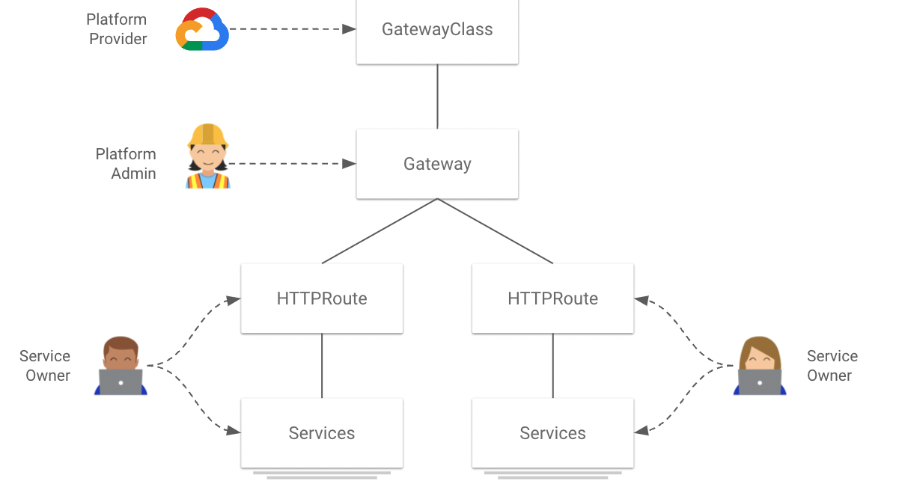
  </p>

  The multi-cluster gateway architecture leverages a hub-and-spoke model where a central **config cluster** (`cluster1`) controls routing policies while application workloads are deployed across **workload clusters** (`cluster2` in `us-east1` and `cluster3` in `us-central1`). All clusters are grouped logically within a **GKE Fleet** to enable secure cross-cluster service discovery and unified load balancing.

  <p align="center">
    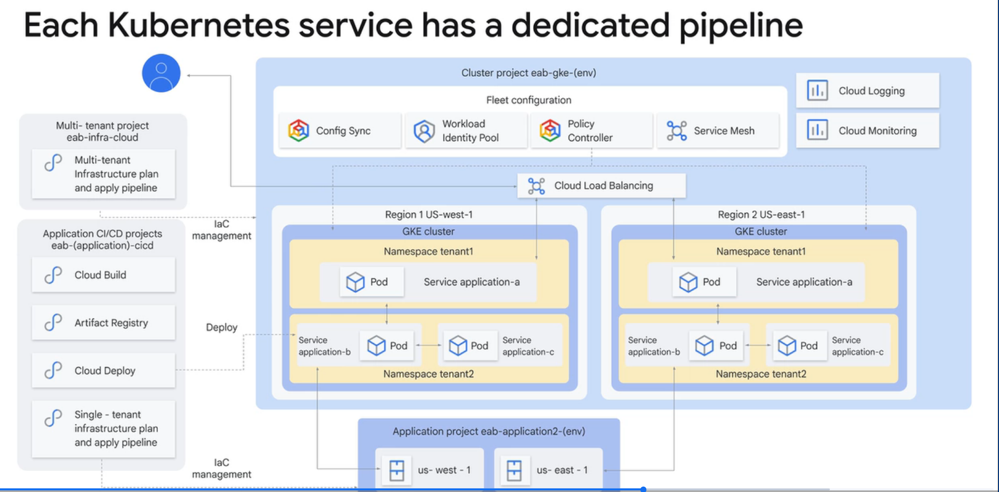
  </p>

  ## Business Problem
  Enterprises deploying containerized workloads at scale face significant operational and architectural challenges when routing client traffic across multiple regions and Kubernetes clusters:
  - **Operational Overhead:** Managing separate regional load balancers and complex DNS routing policies (such as GeoDNS or round-robin) requires extensive coordination and increases the risk of misconfigurations.
  - **Failover and Reliability:** Implementing automatic failover for regional outages typically involves slow DNS updates, leading to increased client-facing downtime.
  - **Tight Coupling:** Application developers often have to write custom routing logic or configure individual ingress controllers per cluster, distracting them from business logic.
  - **Namespace Fragmentation:** Different engineering teams deploying workloads in identical namespaces across multiple clusters lack a unified, standardized way to share and export services.

  ## Solution Overview
  This architecture addresses these issues by decoupling application deployment from traffic routing using GKE's native Multi-Cluster Gateway controller and Multi-Cluster Services (MCS) API:
  - **Decoupled Roles:** Platform administrators manage security policies, TLS certificates, and global load balancers (via `Gateway` resources), while service owners independently configure routing rules (via `HTTPRoute` resources).
  - **Proximity-Based Routing:** Google Cloud's Global Application Load Balancer automatically routes traffic to the nearest healthy backend cluster relative to the client's location.
  - **Automated Cross-Cluster Service Discovery:** MCS automatically discovers pods matching a Service across different clusters and registers them under a single, fleet-wide service representation (`ServiceImport`), enabling seamless failover and traffic aggregation.
  - **Consistent Policy Enforcement:** Centralized configuration of gateway routing in a dedicated config cluster eliminates configuration drift across target clusters.

  <p align="center">
    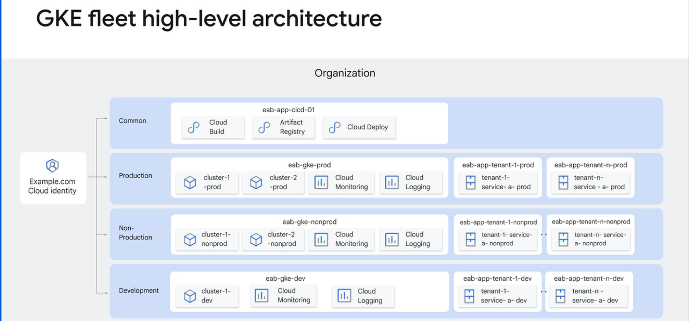
  </p>

  ## Reference Architecture
<p align="center">
    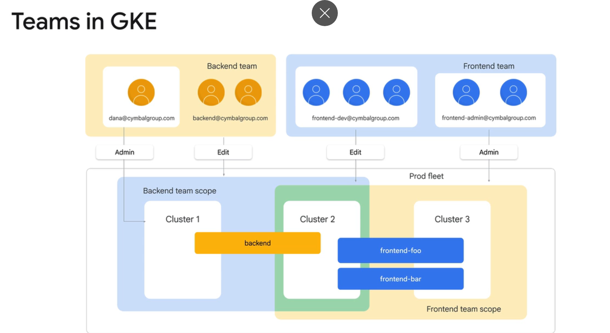
  </p>


  The GKE Multi-Cluster Ingress and Gateway architecture is composed of the following key components:
  1. **GKE Fleet:** A logical grouping of GKE clusters under a single project that enables workload identity federation and shared service scopes.
  2. **Config Cluster (`cluster1`):** A GKE cluster dedicated to hosting the Gateway and HTTPRoute manifests. The Multi-Cluster Ingress controller watches this cluster for routing definitions.
  3. **Target Workload Clusters (`cluster2` & `cluster3`):** Regional GKE clusters hosting the application pods. Traffic is routed directly from the global Google Cloud load balancer to the pod IPs using Container-Native Load Balancing (Network Endpoint Groups).
  4. **ServiceExport & ServiceImport:** The MCS API primitives. A `ServiceExport` in a workload cluster exports a service name to the Fleet. The MCS importer controller in turn generates a corresponding `ServiceImport` resource, making the service addressable across the fleet.
  5. **Gateway Controller:** A Google-hosted controller that listens to the config cluster, provisions Google Cloud Load Balancing resources, registers Network Endpoint Groups (NEGs) from the workload clusters, and configures health checks.

  
  ## Design Decisions & Trade-offs

  The architectural choices for this project are justified below:

  | Technology Chosen | Category | Documentation | Architectural Rationale & Trade-offs |
  | :--- | :--- | :--- | :--- |
  | **GKE** | Managed Kubernetes | [docs](https://cloud.google.com/kubernetes-engine/docs) | Used GKE over self-managed Kubernetes on GCE to eliminate control plane maintenance overhead, automate cluster updates, and utilize native integrations with Google Cloud IAM and Load Balancing. |
  | **VPC** | Cloud Networking | [docs](https://cloud.google.com/vpc/docs) | Used a VPC over default network settings to establish private subnet boundaries and enable container-native routing via alias IP ranges. |
  | **GKE Fleets** | Cluster Grouping | GKE Fleets <!-- TODO: add official doc link --> | Used GKE Fleets over individual cluster management to group clusters logically, allowing them to share Services and configure multi-cluster features consistently. |
  | **Multi-Cluster Services (MCS)** | Service Discovery | Multi-Cluster Services <!-- TODO: add official doc link --> | Used MCS over manual endpoint synchronization or external DNS tools to automatically aggregate pod endpoints across multiple clusters into a single fleet-wide service. |
  | **Multi-Cluster Gateways (MCG)** | L7 Load Balancing | Multi-Cluster Gateways <!-- TODO: add official doc link --> | Used MCG over independent regional load balancers to deploy a single global Application Load Balancer that dynamically routes traffic based on client proximity and backend health. |
  | **Workload Identity** | Identity Federation | Workload Identity <!-- TODO: add official doc link --> | Used Workload Identity over static service account keys to grant Kubernetes service accounts fine-grained GCP IAM permissions securely. |

  ## Prerequisites

  Before starting the implementation, ensure the following prerequisites are met:
  1. **Google Cloud Project:** Access to an active GCP project with billing enabled.
  2. **CLI Tools:** The `gcloud` CLI and `kubectl` must be installed and authenticated to your project.
  3. **IAM Permissions:** You must have Owner or Editor permissions on the project, or explicitly hold `roles/container.admin`, `roles/compute.networkViewer`, and `roles/owner` for GKE-related service accounts.
  4. **Environment Variables:** Set up your environment variables as described in the next section.

  ## Repository Structure

  The declarative configurations are organized into separate directories for application workloads and configuration routing rules to represent a clean separation of roles between platform administrators and application service owners:

  ```
  .
  ├── README.md
  ├── images/                      # Renamed and structured screenshot and diagram assets
  │   ├── all-three-clusters-fetching-credentials.png
  │   ├── all-three-clusters-registered-to-fleet.png
  │   ├── architecture-overview.png
  │   ├── cluster1-provisioning-initiated.png
  │   ├── cluster2-provisioning-initiated.png
  │   ├── cluster3-provisioning-initiated.png
  │   ├── cluster3-responses.png
  │   ├── config-sync-architecture.png
  │   ├── context-renaming-all-three-cluster-credentials.png
  │   ├── curl-external-ip-west-and-east.png
  │   ├── deleting-anthos-fleet.png
  │   ├── describing-and-listing-all-clusters-in-fleet.png
  │   ├── enable-anthos-api.png
  │   ├── enabling-and-describing-fleet-ingress.png
  │   ├── external-http-gateway-explainer.png
  │   ├── fleet-shared-scopes-teams.png
  │   ├── fleets-created.png
  │   ├── gateway-classes-in-cluster1.png
  │   ├── gcloud-fleet-ingress-enable-and-describe-fleet.png
  │   ├── gcloud-policy-binding-to-gateway-class.png
  │   ├── gke-multi-env-architecture.png
  │   ├── iam-policy-continued.png
  │   ├── kubectl-get-external-http-address.png
  │   ├── mcs-across-cluster-explainer-full.png
  │   ├── mcs-across-cluster-explainer.png
  │   ├── microservice-multi-region-multicluster-architecture.png
  │   ├── multi-cluster-iam-policy-updated.png
  │   ├── output-on-west-route-cluster2-responses.png
  │   ├── registering-fleet-gke.png
  │   ├── service-exports-cl2.png
  │   ├── shift-left-benefit.png
  │   ├── successfully-onboarded-fleets.png
  │   ├── three-clusters-ready-unregistered.png
  │   └── three-gke-clusters-regional-distribution.png
  └── manifests/                   # Kubernetes manifests
      ├── app/                     # Workload deployments and service exports
      │   ├── store-deployment.yaml
      │   ├── store-east-service.yaml
      │   └── store-west-service.yaml
      └── config/                  # Ingress routing, gateway classes and routes
          ├── external-http-gateway.yaml
          └── public-store-route.yaml
  ```

  - [store-deployment.yaml](file:///d:/HP/Documents/coursera/GCP/GKE/MultiClusterGKE/multi-cluster-gateway/manifests/app/store-deployment.yaml): Configures the target namespace `store` and deployment of the `whereami` application across the workload clusters.
  - [store-west-service.yaml](file:///d:/HP/Documents/coursera/GCP/GKE/MultiClusterGKE/multi-cluster-gateway/manifests/app/store-west-service.yaml): Provisions services and exports them in the western workload cluster.
  - [store-east-service.yaml](file:///d:/HP/Documents/coursera/GCP/GKE/MultiClusterGKE/multi-cluster-gateway/manifests/app/store-east-service.yaml): Provisions services and exports them in the eastern workload cluster.
  - [external-http-gateway.yaml](file:///d:/HP/Documents/coursera/GCP/GKE/MultiClusterGKE/multi-cluster-gateway/manifests/config/external-http-gateway.yaml): Configures the external multi-cluster gateway in the config cluster.
  - [public-store-route.yaml](file:///d:/HP/Documents/coursera/GCP/GKE/MultiClusterGKE/multi-cluster-gateway/manifests/config/public-store-route.yaml): Configures route matching rules, forwarding path prefixes to their respective regional service imports.

  ## Environment Variables

  To execute the commands in this guide, export the following environment variables. Replace the values with your specific project details:

  ```bash
  # Set your GCP Project ID
  export PROJECT_ID="qwiklabs-gcp-01-009a338fabab"

  # Set Regional Configurations
  export REGION_1="us-east1"
  export ZONE_1="us-east1-b"
  export REGION_2="us-central1"
  export ZONE_2="us-central1-a"

  # Set Fleet Name
  export FLEET_NAME="my-gke-fleet"
  ```

  ---

  ## Implementation

  ### Phase 1: Enable Fleet API and Create a Fleet

  The fleet provides the foundation for multi-cluster GKE features. Enable the Anthos / Fleet API and create the fleet.

  ```bash
  # Enable the Anthos/Fleet API
  gcloud services enable anthos.googleapis.com --project=$PROJECT_ID
  ```
  <p align="center">
    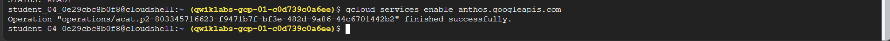
  </p>

  ```bash
  # Create the empty Fleet
  gcloud container fleet create --display-name=$FLEET_NAME --project=$PROJECT_ID
  ```
  <p align="center">
    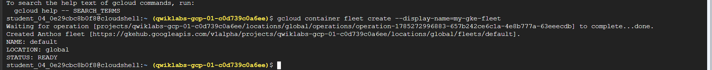
  </p>

  ### Phase 2: Deploy GKE Clusters

  Deploy three GKE clusters. `cluster1` and `cluster2` are deployed in `us-east1-b`. `cluster3` is deployed in `us-central1-a`. 

  ```bash
  # Create Cluster 1 (Config Cluster) in us-east1-b asynchronously
  gcloud container clusters create cluster1 \
    --zone=$ZONE_1 \
    --enable-ip-alias \
    --machine-type=e2-standard-4 \
    --num-nodes=1 \
    --workload-pool=$PROJECT_ID.svc.id.goog \
    --release-channel=regular \
    --project=$PROJECT_ID --async

  # Create Cluster 2 (Workload Cluster) in us-east1-b asynchronously
  gcloud container clusters create cluster2 \
    --zone=$ZONE_1 \
    --enable-ip-alias \
    --machine-type=e2-standard-4 \
    --num-nodes=1 \
    --workload-pool=$PROJECT_ID.svc.id.goog \
    --release-channel=regular \
    --project=$PROJECT_ID --async

  # Create Cluster 3 (Workload Cluster) in us-central1-a synchronously
  gcloud container clusters create cluster3 \
    --zone=$ZONE_2 \
    --enable-ip-alias \
    --machine-type=e2-standard-4 \
    --num-nodes=1 \
    --workload-pool=$PROJECT_ID.svc.id.goog \
    --release-channel=regular \
    --project=$PROJECT_ID
  ```
  <p align="center">
    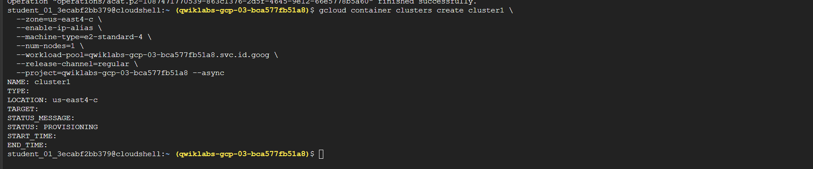
  </p>
  <p align="center">
    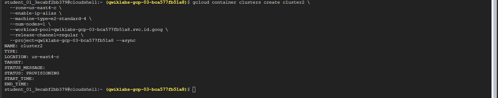
  </p>
  <p align="center">
    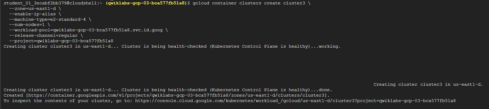
  </p>

  Once the creation finishes, confirm that all three clusters are active:
  ```bash
  # List all running GKE clusters
  gcloud container clusters list --project=$PROJECT_ID
  ```
  <p align="center">
    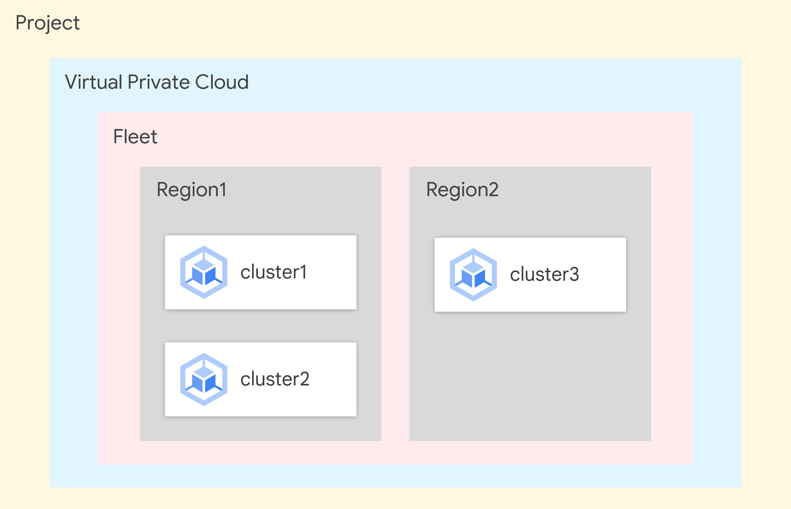
  </p>
  <p align="center">
    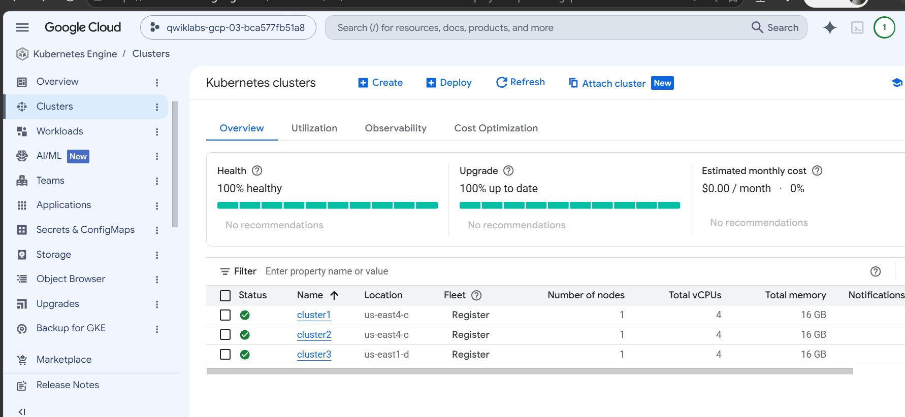
  </p>

  ### Phase 3: Configure Cluster Credentials and Enable Gateway API

  Configure cluster credentials and rename their contexts for simpler reference. Enable the multi-cluster Gateway API on `cluster1` (the config cluster).

  ```bash
  # Retrieve credentials for all three clusters
  gcloud container clusters get-credentials cluster1 --zone=$ZONE_1 --project=$PROJECT_ID
  gcloud container clusters get-credentials cluster2 --zone=$ZONE_1 --project=$PROJECT_ID
  gcloud container clusters get-credentials cluster3 --zone=$ZONE_2 --project=$PROJECT_ID
  ```
  <p align="center">
    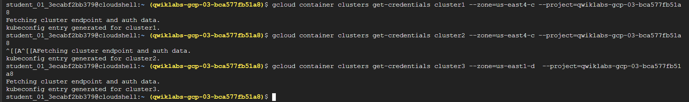
  </p>

  ```bash
  # Rename the contexts to clean identifiers
  kubectl config rename-context gke_${PROJECT_ID}_${ZONE_1}_cluster1 cluster1
  kubectl config rename-context gke_${PROJECT_ID}_${ZONE_1}_cluster2 cluster2
  kubectl config rename-context gke_${PROJECT_ID}_${ZONE_2}_cluster3 cluster3
  ```
  <p align="center">
    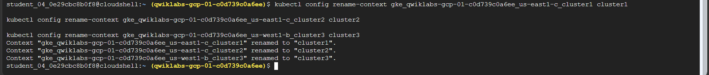
  </p>

  ```bash
  # Enable the standard Gateway API on cluster1
  gcloud container clusters update cluster1 --gateway-api=standard --region=$ZONE_1 --project=$PROJECT_ID
  ```

  > [!WARNING]
  > Enabling the multi-cluster Gateway API on GKE clusters can take up to 5 minutes to fully sync with the GKE control plane. Do not proceed to registration until this operation is completed.

  ### Phase 4: Register Clusters to the Fleet

  Register all three clusters to the GKE Fleet with Workload Identity enabled.

  <p align="center">
    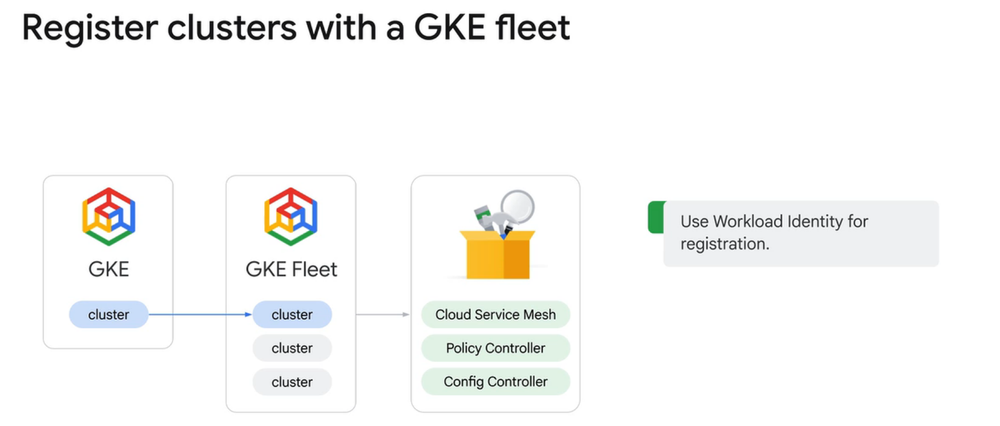
  </p>

  ```bash
  # Register cluster1, cluster2, and cluster3 to the fleet
  gcloud container fleet memberships register cluster1 \
    --gke-cluster $ZONE_1/cluster1 \
    --enable-workload-identity \
    --project=$PROJECT_ID

  gcloud container fleet memberships register cluster2 \
    --gke-cluster $ZONE_1/cluster2 \
    --enable-workload-identity \
    --project=$PROJECT_ID

  gcloud container fleet memberships register cluster3 \
    --gke-cluster $ZONE_2/cluster3 \
    --enable-workload-identity \
    --project=$PROJECT_ID
  ```

  Verify that all memberships have been successfully added:
  ```bash
  # List all fleet memberships
  gcloud container fleet memberships list --project=$PROJECT_ID
  ```
  <p align="center">
    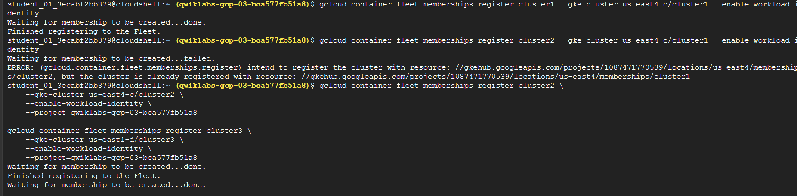
  </p>
  <p align="center">
    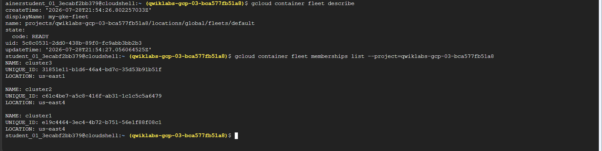
  </p>

  ### Phase 5: Enable and Configure Multi-Cluster Services (MCS)

  <p align="center">
    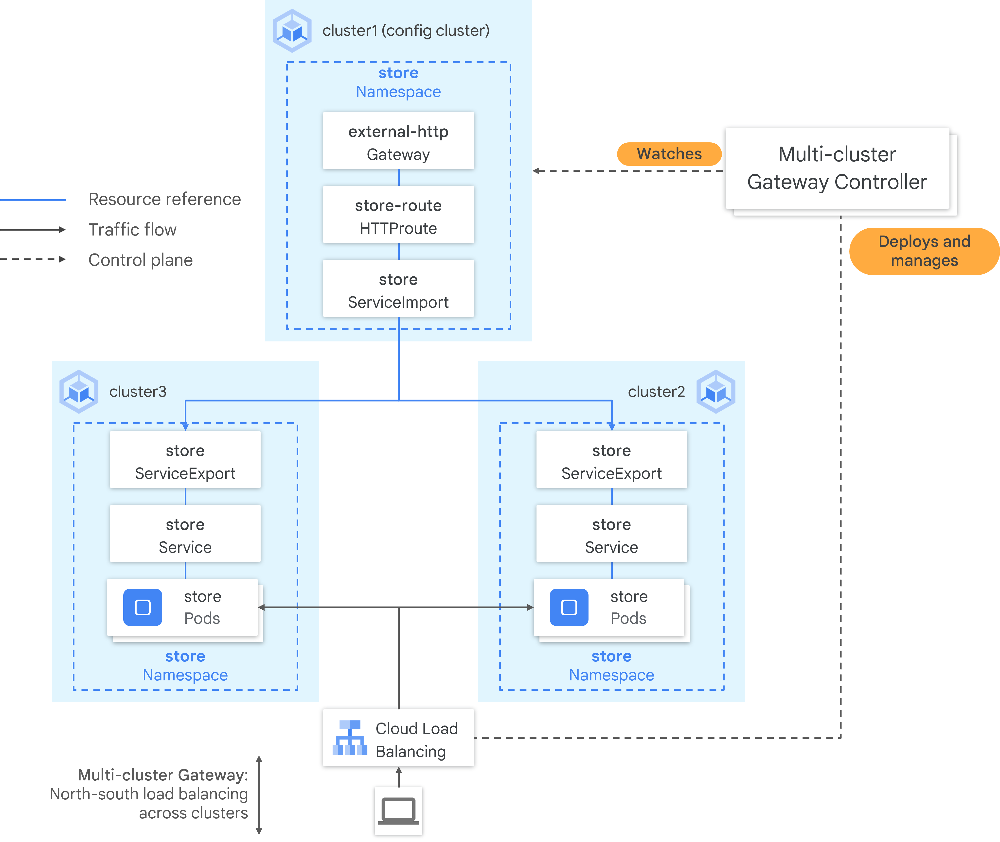
  </p>

  Enable the MCS feature in your GKE fleet to allow cross-cluster communication and service discovery:

  ```bash
  # Enable Multi-Cluster Services in the Fleet
  gcloud container fleet multi-cluster-services enable --project=$PROJECT_ID
  ```

  Bind the Compute Network Viewer IAM role to the MCS importer service account, allowing it to retrieve Network Endpoint Group properties:

  ```bash
  # Add IAM policy binding for MCS Importer
  gcloud projects add-iam-policy-binding $PROJECT_ID \
    --member "serviceAccount:$PROJECT_ID.svc.id.goog[gke-mcs/gke-mcs-importer]" \
    --role "roles/compute.networkViewer" \
    --project=$PROJECT_ID
  ```
  <p align="center">
    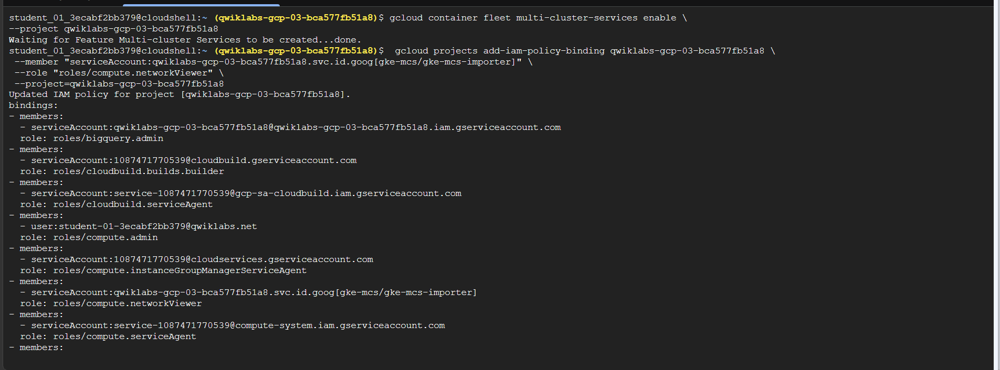
  </p>
  <p align="center">
    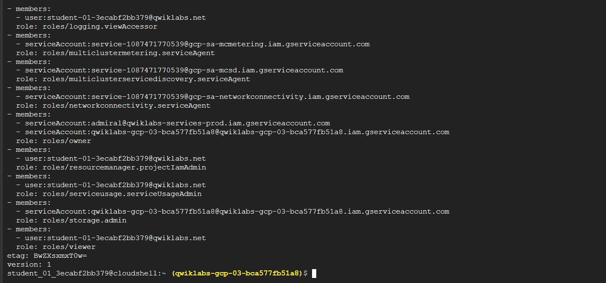
  </p>

  Verify that MCS is active and shows all registered cluster memberships:
  ```bash
  # Describe MCS feature state
  gcloud container fleet multi-cluster-services describe --project=$PROJECT_ID
  ```
  <p align="center">
    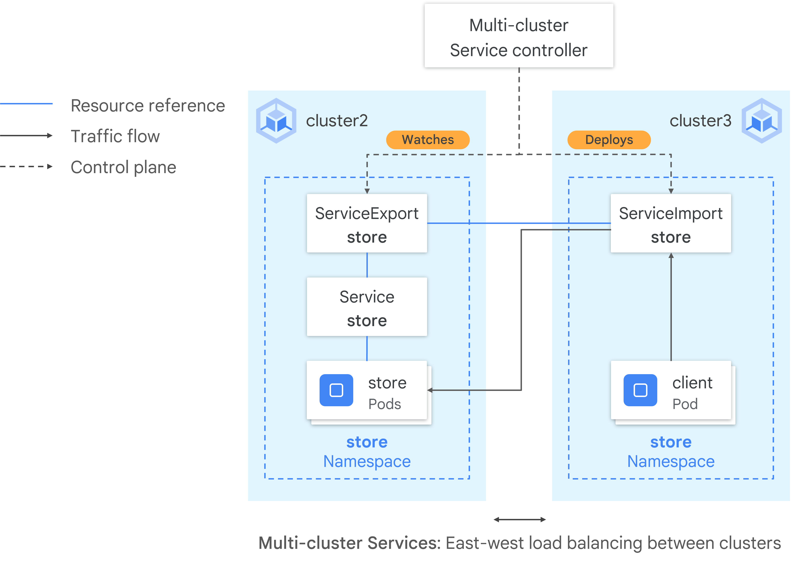
  </p>

  ### Phase 6: Enable Multi-Cluster Gateway (MCG) Controller

  Configure `cluster1` as the designated configuration cluster for the Multi-Cluster Ingress and Gateway controller:

  ```bash
  # Enable Multi-Cluster Ingress with cluster1 as the config cluster
  gcloud container fleet ingress enable \
    --config-membership=cluster1 \
    --project=$PROJECT_ID \
    --location=$ZONE_1
  ```
  <p align="center">
    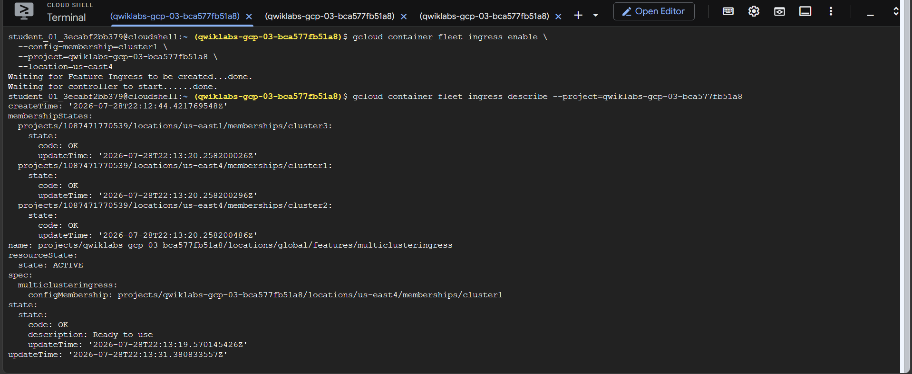
  </p>
  <p align="center">
    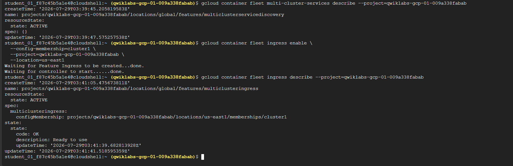
  </p>

  Grant GKE Gateway controller administrative access to GKE API resources:

  ```bash
  # Grant roles/container.admin to Multi-Cluster Ingress Service Account
  gcloud projects add-iam-policy-binding $PROJECT_ID \
    --member "serviceAccount:service-63415147657@gcp-sa-multiclusteringress.iam.gserviceaccount.com" \
    --role "roles/container.admin" \
    --project=$PROJECT_ID
  ```
  <p align="center">
    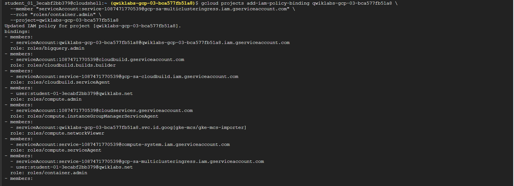
  </p>

  Verify that multi-cluster GatewayClasses are populated in the config cluster:
  ```bash
  # List available gatewayclasses in cluster1
  kubectl get gatewayclasses --context=cluster1
  ```
  <p align="center">
    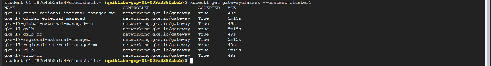
  </p>

  ### Phase 7: Deploy the Application

  Deploy the namespace and application workloads on the regional clusters `cluster2` and `cluster3`.

  <p align="center">
    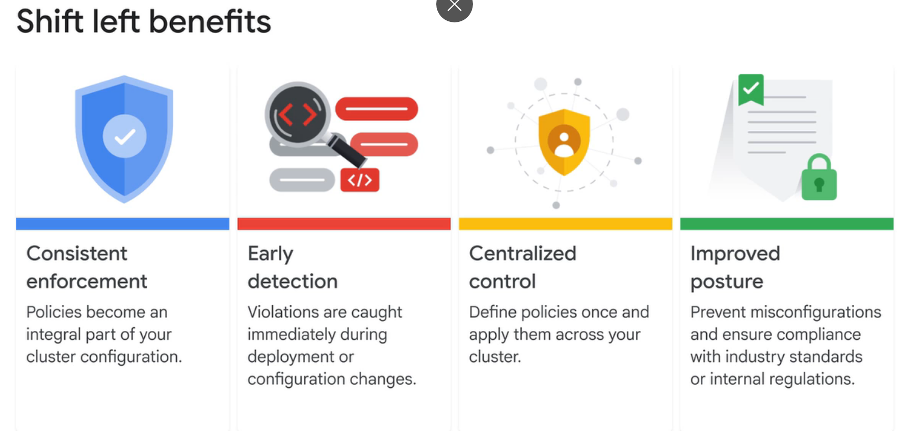
  </p>

  ```bash
  # Apply the application deployment on cluster2 and cluster3
  kubectl apply -f manifests/app/store-deployment.yaml --context=cluster2
  kubectl apply -f manifests/app/store-deployment.yaml --context=cluster3

  # Apply regional service configuration and exports on cluster2 (West)
  kubectl apply -f manifests/app/store-west-service.yaml --context=cluster2

  # Apply regional service configuration and exports on cluster3 (East)
  kubectl apply -f manifests/app/store-east-service.yaml --context=cluster3
  ```

  Verify that the ServiceExports are created successfully:
  ```bash
  # List ServiceExports in cluster2 and cluster3
  kubectl get serviceexports --context=cluster2 --namespace=store
  kubectl get serviceexports --context=cluster3 --namespace=store
  ```
  <p align="center">
    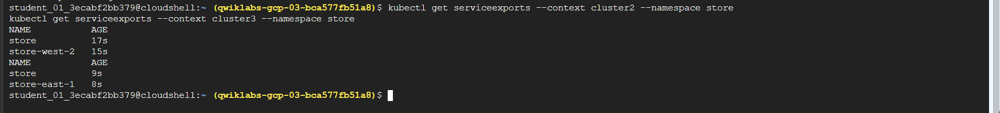
  </p>

  ### Phase 8: Deploy the Gateway and HTTPRoute

  Deploy the Gateway and HTTPRoute configurations in the `cluster1` config cluster to spin up the external Application Load Balancer.

  ```bash
  # Deploy Gateway configuration to the config cluster (cluster1)
  kubectl apply -f manifests/config/external-http-gateway.yaml --context=cluster1

  # Deploy HTTPRoute configuration to the config cluster (cluster1)
  kubectl apply -f manifests/config/public-store-route.yaml --context=cluster1
  ```

  ---

  ## Validation

  Verify that the Gateway has been scheduled and programmed successfully:

  ```bash
  # Describe Gateway status in cluster1
  kubectl describe gateway external-http --context=cluster1 --namespace=store
  ```
  <p align="center">
    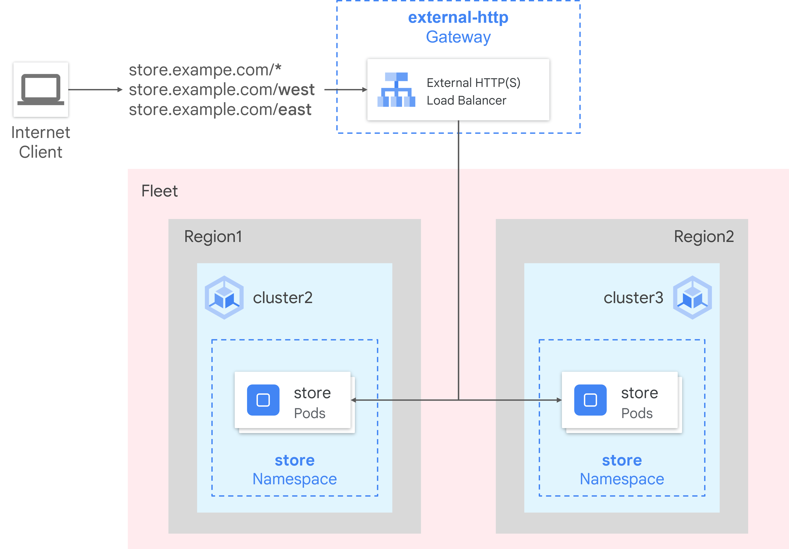
  </p>

  Wait for the external IP address of the load balancer to be provisioned (this can take up to 10 minutes):

  ```bash
  # Retrieve Gateway external IP address
  EXTERNAL_IP=$(kubectl get gateway external-http -o=jsonpath="{.status.addresses[0].value}" --context=cluster1 --namespace=store)
  echo $EXTERNAL_IP
  ```
  <p align="center">
    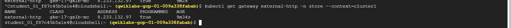
  </p>

  ### Traffic Verification

  Test the default routing policy (closest region). This load balances across all clusters with the default namespace matching rule:

  ```bash
  # Send traffic to the root path
  curl http://${EXTERNAL_IP}
  ```

  Verify that path-based routing redirects traffic specifically to the western workload cluster (`cluster2`) when `/west` is matched:

  ```bash
  # Send traffic to the west path
  curl http://${EXTERNAL_IP}/west
  ```
  <p align="center">
    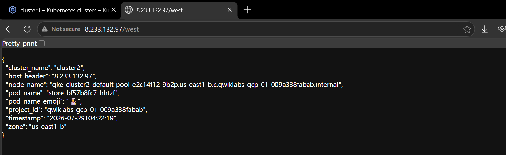
  </p>

  Verify that path-based routing redirects traffic specifically to the eastern workload cluster (`cluster3`) when `/east` is matched:

  ```bash
  # Send traffic to the east path
  curl http://${EXTERNAL_IP}/east
  ```
  <p align="center">
    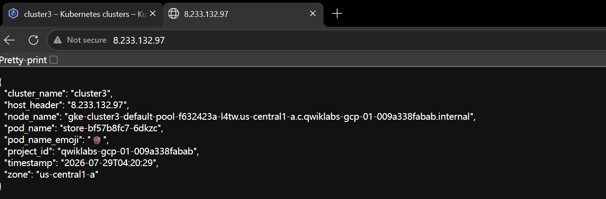
  </p>
  <p align="center">
    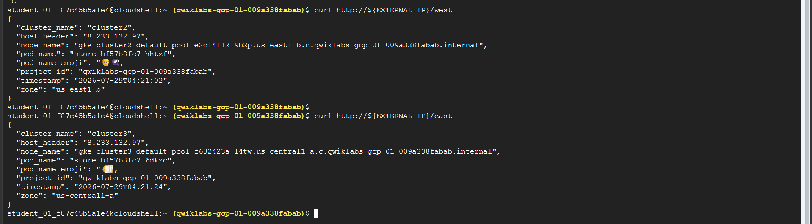
  </p>

  ---

  ## Observability

  To inspect the routing traffic, health metrics, and backends of your Multi-Cluster Gateway:
  1. Navigate to the Google Cloud Console.
  2. Select **Kubernetes Engine** > **Gateways, Services & Ingress**.
  3. Under the **Gateways** tab, select the `external-http` gateway.
  4. Review the traffic forwarding metrics, frontend configurations, and backend Network Endpoint Groups (NEGs) associated with each `ServiceImport`.

  ---

  ## Troubleshooting

  - **Delay in External IP Allocation:** Provisioning a Global Application Load Balancer can take up to 10 minutes. If `EXTERNAL_IP` is empty, wait and repeat the query.
  - **Sync Failures / Accepted: False:** Inspect the Gateway status with `kubectl describe gateway`. Ensure that the config cluster context is correct and that the IAM bindings for `service-63415147657@gcp-sa-multiclusteringress.iam.gserviceaccount.com` hold the `container.admin` role.
  - **ServiceImport Not Resolving / 404 Routing:** Ensure that the workloads (`store` deployment) are running in both `cluster2` and `cluster3` and that the namespace matches exactly (`store`) on all three clusters.

  ---

  ## Cleanup

  Delete the resources deployed in this lab to avoid incurring continuous charges on your Google Cloud Platform account:

  ```bash
  # Delete Gateway and HTTPRoute from config cluster (cluster1)
  kubectl delete -f manifests/config/public-store-route.yaml --context=cluster1
  kubectl delete -f manifests/config/external-http-gateway.yaml --context=cluster1

  # Delete applications from workload clusters (cluster2 and cluster3)
  kubectl delete -f manifests/app/store-west-service.yaml --context=cluster2
  kubectl delete -f manifests/app/store-east-service.yaml --context=cluster3
  kubectl delete -f manifests/app/store-deployment.yaml --context=cluster2
  kubectl delete -f manifests/app/store-deployment.yaml --context=cluster3

  # Unregister clusters from the Fleet
  gcloud container fleet memberships unregister cluster1 --gke-cluster=$ZONE_1/cluster1 --project=$PROJECT_ID
  gcloud container fleet memberships unregister cluster2 --gke-cluster=$ZONE_1/cluster2 --project=$PROJECT_ID
  gcloud container fleet memberships unregister cluster3 --gke-cluster=$ZONE_2/cluster3 --project=$PROJECT_ID

  # Delete GKE Clusters
  gcloud container clusters delete cluster1 --zone=$ZONE_1 --project=$PROJECT_ID --quiet --async
  gcloud container clusters delete cluster2 --zone=$ZONE_1 --project=$PROJECT_ID --quiet --async
  gcloud container clusters delete cluster3 --zone=$ZONE_2 --project=$PROJECT_ID --quiet

  # Delete GKE Fleet
  gcloud container fleet delete --project=$PROJECT_ID
  ```
  <p align="center">
    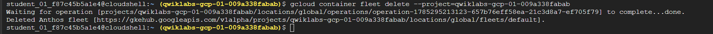
  </p>
